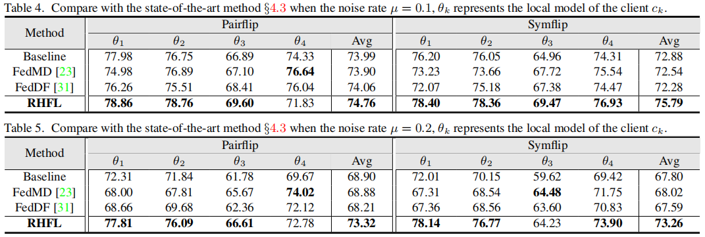

# Robust Federated Learning with Noisy and Heterogeneous Clients

This repository provides resources for the following paper:

> [**Robust Federated Learning with Noisy and Heterogeneous Client**]([CVPR 2022 Open Access Repository](https://openaccess.thecvf.com/content/CVPR2022/html/Fang_Robust_Federated_Learning_With_Noisy_and_Heterogeneous_Clients_CVPR_2022_paper.html))  
> Xiuwen Fang, [Mang Ye](https://marswhu.github.io/index.html)
> *CVPR 2022*

# [RHFL Description](#contents)

RHFL (Robust Heterogeneous Federated Learning) is a federated learning framework to solve the robust federated learning problem with noisy and heterogeneous clients:

1. Aligning the logits output distributions in heterogeneous federated learning.

2. Local noise learning with a noise-tolerant loss function.

3. Client confidence re-weighting for external noise.

# [Framework Architecture](#contents)


# [Dataset](#contents)

Our experiments are conducted on two datasets, Cifar10 and Cifar100. We set public dataset on the server as a subset of Cifar100, and randomly divide Cifar10 to different clients as private datasets.

Dataset used: [CIFAR-10、CIFAR-100](http://www.cs.toronto.edu/~kriz/cifar.html)

Note: Data will be processed in init_data.py

# [Quick Start](#contents)

After installing MindSpore via the official website, you can start training and evaluation as follows:

```bash
# init public data and local data
python Dataset/init_data.py
# pretrain local models
python Network/pretrain.py
# RHFL
python HHF/HHF.py
```

# [Script and Sample Code](#contents)

```bash
├── Robust_FL
    ├── Dataset
        ├── cifar.py
        ├── init_dataset.py
        ├── utils.py
    ├── Network
        ├── Models_Def
            ├── mobilnet_v2.py
            ├── resnet.py
            ├── shufflenet.py
        ├── pretrain.py
    ├── HHF
        ├── HHF.py
    ├── loss.py
    ├── README.md
```

# [Comparison with the SOTA methods](#contents)

In the heterogeneous model scenario, we assign four different networks:ResNet10,ResNet12,ShuffleNet,Mobilenetv2



# [Citation](#contents)

```citation
@inproceedings{fang2022robust,
  title={Robust Federated Learning With Noisy and Heterogeneous Clients},
  author={Fang, Xiuwen and Ye, Mang},
  booktitle={Proceedings of the IEEE/CVF Conference on Computer Vision and Pattern Recognition},
  pages={10072--10081},
  year={2022}
}
```
