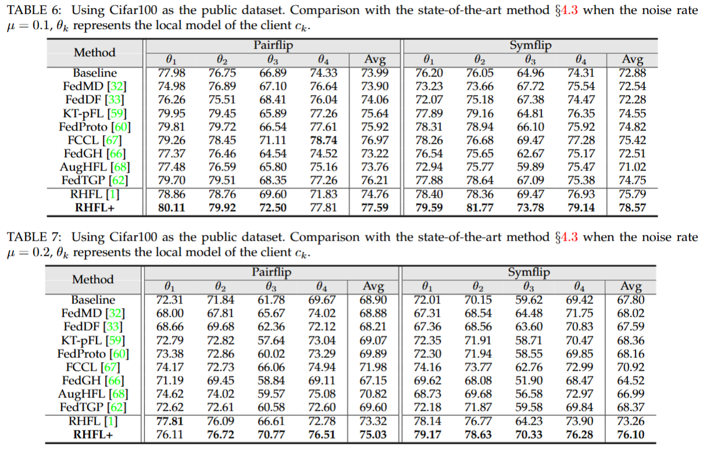

# Noise-Robust Federated Learning With Model Heterogeneous Clients

This repository provides resources for the following paper:

> [**Noise-Robust Federated Learning With Model Heterogeneous Clients**](https://ieeexplore.ieee.org/abstract/document/10816157)
> Xiuwen Fang, [Mang Ye](https://marswhu.github.io/index.html)
> *IEEE TMC*

# [RHFL+ Description](#contents)

RHFL+ is  a further solution for the robust federated learning problem with noisy and heterogeneous clients: 

1. Aligning the logits output distributions in heterogeneous federated learning.

2. Dynamic label refinement for local noise.

3. Enhanced client confidence re-weighting for external noise.

# [Framework Architecture](#contents)


# [Dataset](#contents)

Our experiments are conducted on two datasets, Cifar10 and Cifar100. We set public dataset on the server as a subset of Cifar100, and randomly divide Cifar10 to different clients as private datasets.

Dataset used: [CIFAR-10、CIFAR-100](http://www.cs.toronto.edu/~kriz/cifar.html)

Note: Data will be processed in init_data.py

# [Quick Start](#contents)

You can start training and evaluation as follows:

```bash
# pretrain local models
cd Network
python pretrain.py
# RHFL+
cd HHF
python RHFL+.py
```

# [Script and Sample Code](#contents)

```bash
├── Robust_FL
    ├── Dataset
        ├── __init__.py
        ├── cifar.py
        ├── init_dataset.py
        ├── utils.py
    ├── Network
        ├── Models_Def
            ├── mobilnet_v2.py
            ├── resnet.py
            ├── shufflenet.py
        ├── pretrain.py
    ├── HHF
        ├── RHFL+.py
    ├── loss.py
    ├── README.md
```

# [Comparison with the SOTA methods](#contents)

In the heterogeneous model scenario, we assign four different networks:ResNet10,ResNet12,ShuffleNet,Mobilenetv2



# [Citation](#contents)

```citation
@article{fang2024noise,
  title={Noise-Robust Federated Learning With Model Heterogeneous Clients},
  author={Fang, Xiuwen and Ye, Mang},
  journal={IEEE Transactions on Mobile Computing},
  year={2024},
  publisher={IEEE}
}
```
